# 🛢️ PetroTwin

**Well-to-Surface Digital Twin for Cyclic Steam Stimulation and Sucker-Rod Pump Operations**

Smart India Hackathon 2026 · Problem Statement **SIH26120**: *Digital Twin for Well-to-Surface Optimization of Cyclic Steam Stimulation (CSS) and Sucker Rod Pump (SRP) Operations for Heavy Oil Wells of Baghewala Field* · Oil India Limited · Smart Automation


[](LICENSE)
[](https://indian-oil-limited-sih-2026.vercel.app)

### 🔗 Live demo: **[indian-oil-limited-sih-2026.vercel.app](https://indian-oil-limited-sih-2026.vercel.app)**

Opens straight into the dashboard; no login needed. Try the [3D well sandbox](https://indian-oil-limited-sih-2026.vercel.app/wells/BG-023/3d) or [run the optimizer](https://indian-oil-limited-sih-2026.vercel.app/wells/BG-023/optimize?autorun=1).

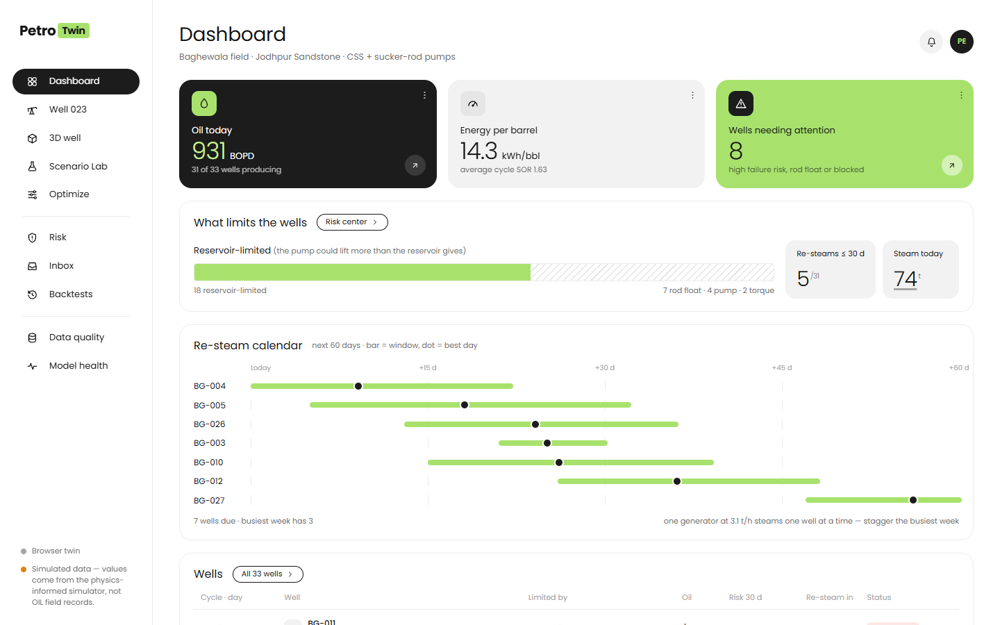

## The problem

Baghewala is a heavy-oil field in Rajasthan. The crude is thick (about 11,500 cP at 50 °C), the reservoir is cool (about 47 °C) and its pressure is low. Oil India heats the rock with **Cyclic Steam Stimulation**: inject steam, let it soak, then produce. **Sucker-rod pumps** lift the oil to the surface.

Today the two are run separately. The steam cycle is planned from experience, the pump runs at a fixed speed, and wells are re-steamed on a habit-based day. But they are one system. The steam decides how hot the well is, the heat decides how thick the oil is, and the thickness decides how hard the pump works and whether the rods keep up.

The production engineer needs one answer, for every well, at any moment:

> **What is limiting this well right now, and which steam cycle, pump plan and re-steam day give the most value while keeping steam use, energy and equipment risk inside limits?**

## Our approach

The 3D model is not the digital twin; it is the visual index into it. The twin is a **coupled state model** of each well. A steam decision flows through the whole chain, so a change in one place shows up everywhere else:

```
more steam injected
  → larger, hotter zone around the well
    → oil viscosity drops (Walther curve, anchored to OIL's 50 °C value)
      → more oil flows in, and the pump can run faster
        → but as the zone cools, the oil in the tubing thickens
          → the rods fall more slowly than the pump strokes: rod float margin shrinks
            → failure risk rises and the best day to re-steam moves
```

A single physics chain (`src/mocks/model.ts` → `cycle.ts`) computes this. Every page reads from it, so the Dashboard, Well console, 3D sandbox, Scenario Lab, Optimizer and Backtests always agree on the same number.

## What makes PetroTwin different

| | |
|---|---|
| 🔗 **CSS and SRP optimized together** | One optimizer picks steam volume, soak time, the pump-speed plan and the re-steam day as one design, instead of tuning each on its own. |
| 🚦 **Bottleneck Navigator** | For every well: which limit binds now (reservoir inflow, pump, rod float, fatigue, torque), which binds next, what relaxing it is worth in ₹/day, and the changes ranked by net ₹/day. |
| 🪝 **Rod float margin along the whole string** | Shows along the full depth, not just at the surface, where the rods risk falling slower than the pump strokes, with rod stress (Goodman) and fatigue per section. |
| ⏱️ **Re-steam by economics, not habit** | Optimal stopping finds the day to stop and re-steam, with a P10–P90 window. Wells get their own day instead of the habitual day 150. |
| 🛡️ **Safety gate independent of the optimizer** | Every strategy is re-checked against the limits at P90 uncertainty. Close calls go to human review; failures can't be approved. |
| 🧾 **Evidence on every number** | Click any underlined number to see how it was computed: function, inputs, registry version, model versions. ⚑ marks values that rest on assumed inputs. A build check blocks KPI numbers typed into the screens. |
| 🧪 **Proven on history before it touches the field** | Counterfactual backtest: learn on earlier cycles only, forecast the next, keep only cycles where the forecast was good, *then* report the gain. Skill always comes before gains. |
| 🔒 **Tamper-evident decisions** | Approve / Later / Reject, each with a reason, written to a hash-chained audit log. Nothing is ever sent to field equipment. |

## Screenshots

| | |
|---|---|
| 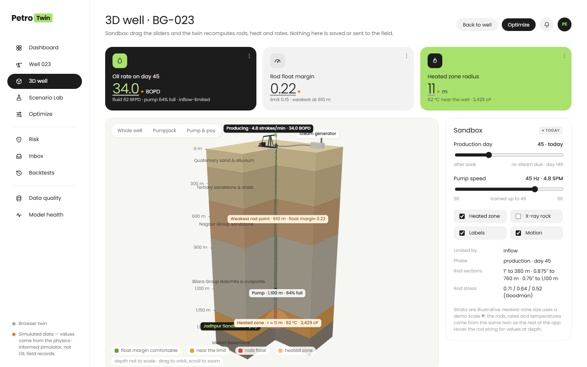 **3D well:** cut-away of the rock layers, the pay zone and the heated zone, with the rod string coloured by float margin. | 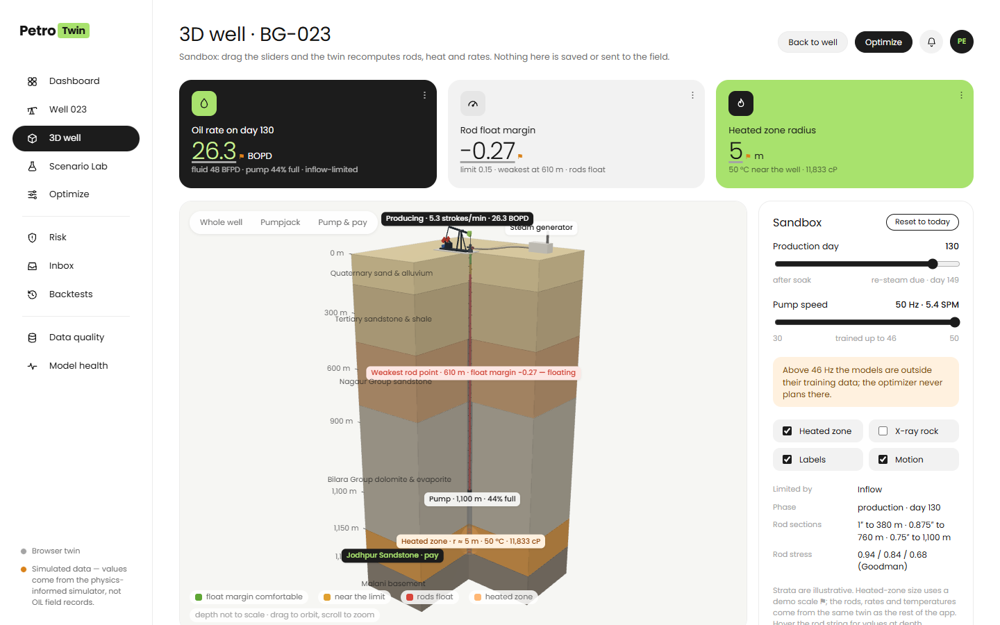 **Sandbox:** push the pump to 50 Hz on day 130 and the rods turn red at 610 m. Every number recomputes. |
| 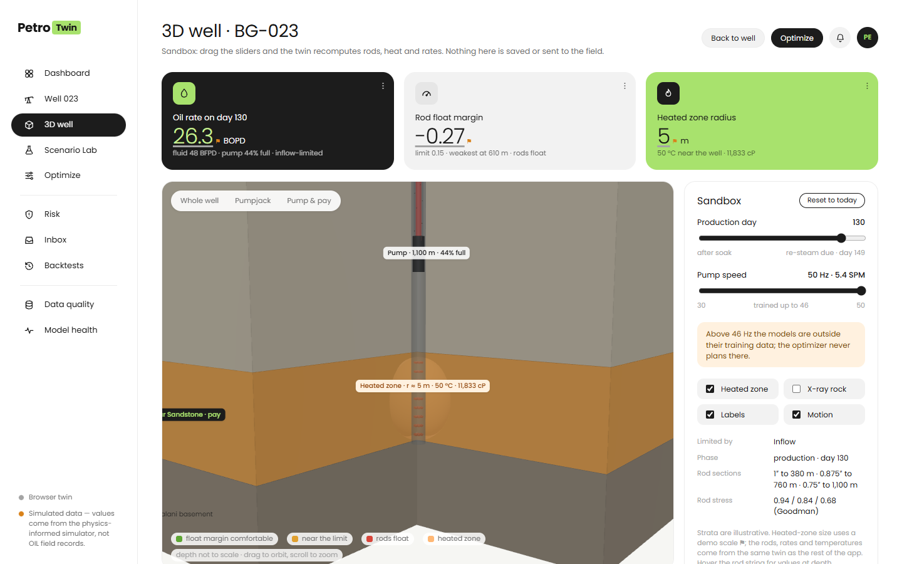 **Pump & pay:** the heated zone around the perforations shrinks and cools through the cycle. | 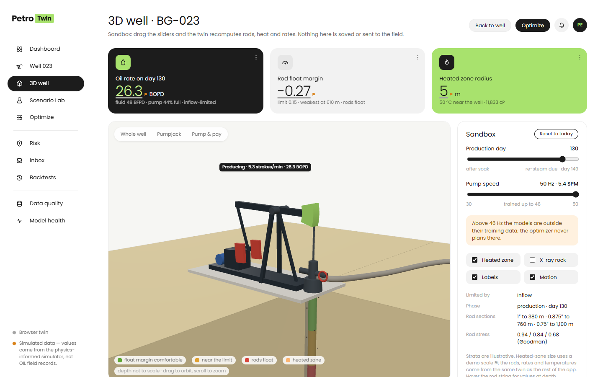 **Pumpjack:** animated at the well's real strokes per minute, with oil rising at the real rate. |
| 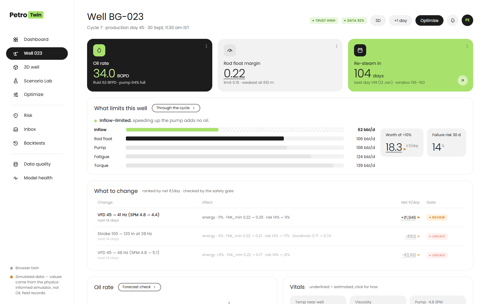 **Well console:** what limits this well, what to change (ranked by net ₹/day and safety-checked), forecast and vitals. | 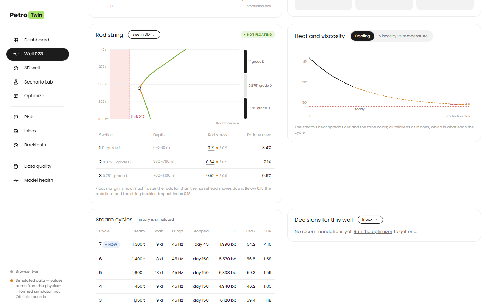 **Rod string and heat:** float margin against depth, rod stress per section, and the cooling curve. |
| 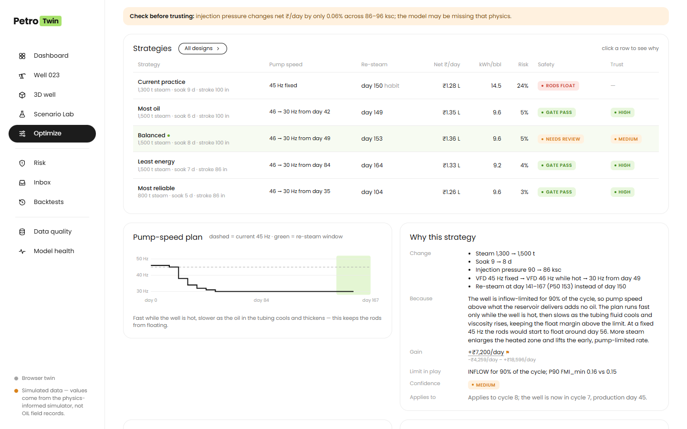 **Optimizer:** four strategies against current practice, each with its pump-speed plan, re-steam day, safety verdict, trust level and a plain-language "why". | 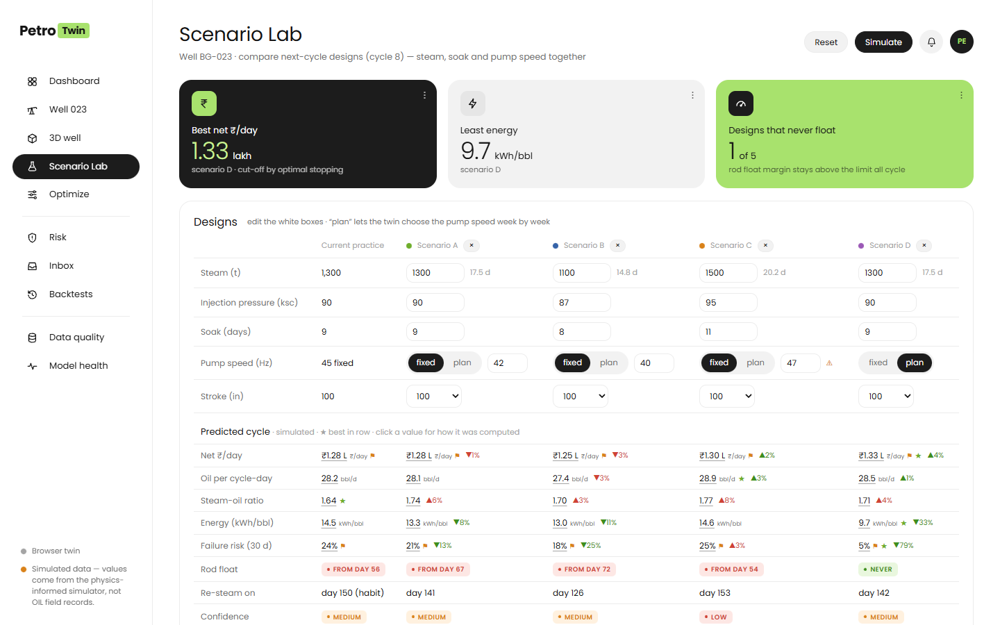 **Scenario Lab:** compare up to four next-cycle designs; "plan" lets the twin schedule the pump speed so the rods never float. |
| 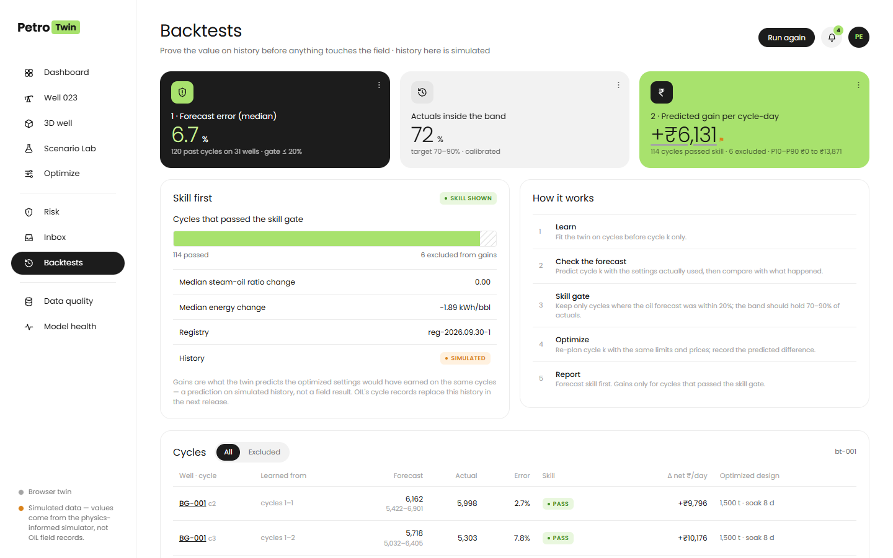 **Backtests:** 120 past cycles on 31 wells. Forecast skill first (median error 6.7%), gains only on the cycles that passed. | 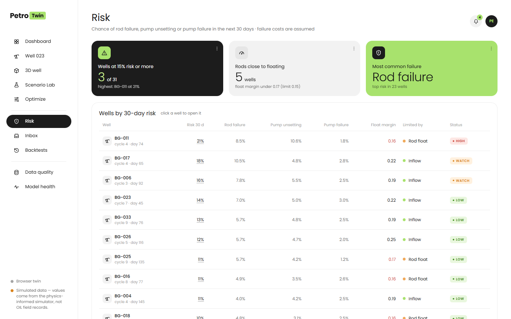 **Risk:** 30-day chance of rod failure, pump unsetting or pump failure for every well, and why. |
| 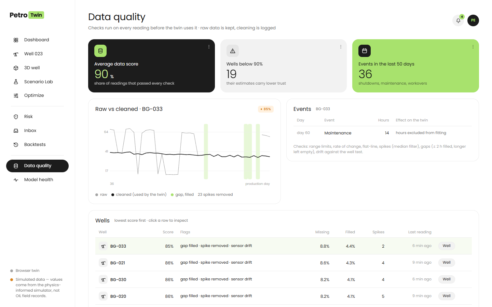 **Data quality:** what the twin cleaned before using it (gaps, spikes, drift, shutdowns), with raw and cleaned readings side by side. | 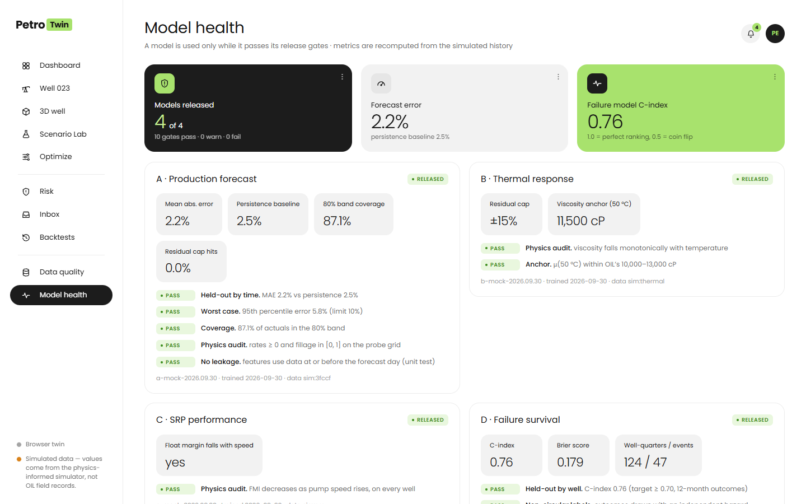 **Model health:** each model is used only while it passes its release gates (held-out error, worst case, coverage, physics audit, leakage). |
| 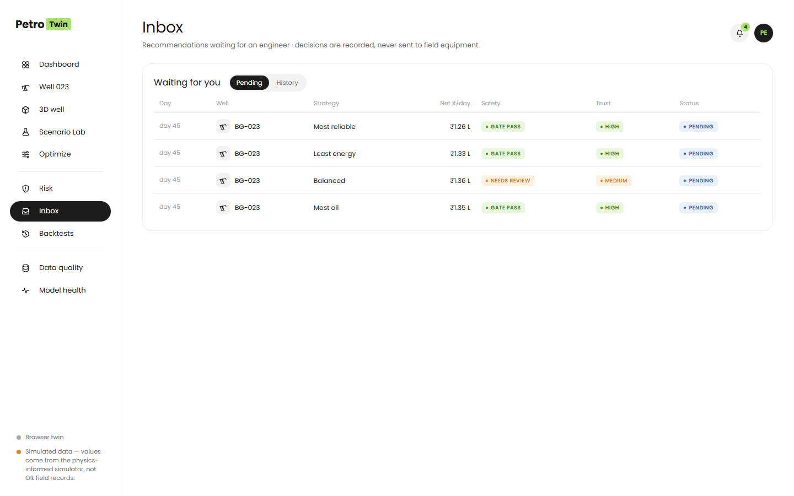 **Inbox:** recommendations waiting for an engineer, and the decision history. | 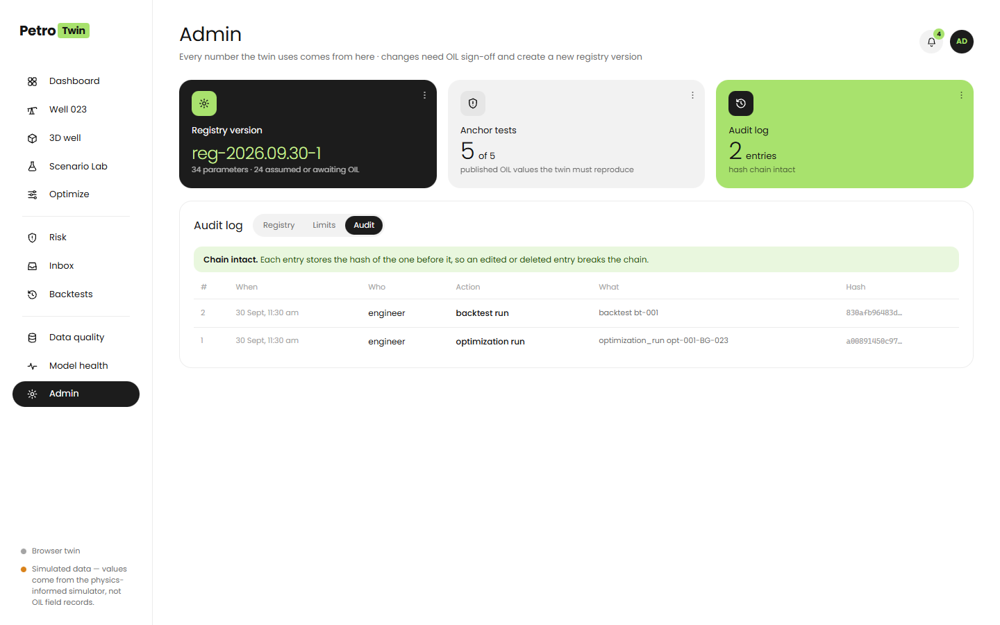 **Admin:** parameter registry with anchor tests against OIL's published values, limits, and the hash-chained audit log. |

## Modules

| Route | Module | What it does |
|---|---|---|
| `/field` | Dashboard | Oil today, energy per barrel, wells needing attention, what limits the field, re-steam calendar for the next 60 days, all 33 wells |
| `/wells/:id` | Well console | Oil rate, rod float margin, re-steam timing; what limits the well and what to change; forecast; vitals; rod string; heat and viscosity; steam cycles; decisions |
| `/wells/:id/3d` | 3D well sandbox | Cut-away earth block, pay zone, heated zone, rod string coloured by float margin, animated pumpjack; day and pump-speed sliders recompute live |
| `/wells/:id/scenario-lab` | Scenario Lab | Up to four next-cycle designs side by side, with a fixed or planned pump speed |
| `/wells/:id/optimize` | Cycle Designer | Joint CSS + SRP optimization: strategies, pump-speed plan, "why", safety gate, trust meter, decision |
| `/risk` | Risk Center | 30-day failure risk per well and failure mode |
| `/recommendations` | Inbox | Pending recommendations and decision history |
| `/backtests` | Backtests | Counterfactual backtest on history: skill first, then gains |
| `/data-quality` | Data Quality | Scores, flags, raw vs cleaned readings, shutdown and workover events |
| `/models` | Model Health | Release gates and metrics for the production, thermal, pump and failure models; training range |
| `/admin` | Admin | Parameter registry with evidence labels and anchor tests, limits, hash-chained audit log (admin role) |

## Getting started

**No install needed:** the app is deployed at **https://indian-oil-limited-sih-2026.vercel.app**. It runs the full twin in your browser; reloading resets the demo.

To run it locally:

**Prerequisites:** Node.js 20+ with npm (Node 22+ for the end-to-end test).

```bash
npm install
npm run dev        # development server at http://localhost:5173
```

For the smoothest demo, run the production build:

```bash
npm run build
npm run preview    # http://localhost:4173
```

## Demo roles

There is no login in this prototype. Switch roles from the **avatar menu** (top right):

| Role | Can do |
|---|---|
| Viewer | Read everything; can't run the optimizer, decide or advance the clock |
| Engineer | Run scenarios, optimizations and backtests; approve, defer or reject |
| Admin | Engineer + the Admin page (registry, limits, audit log) |

## Things to try

1. On the **Dashboard**, look at the re-steam calendar, then open a well from the table.
2. On **Well BG-023**, click any underlined number to see *how it was computed*.
3. Open **3D well**, drag the pump speed to **50 Hz** and the day to **130**: the rods turn red at 610 m. Switch to **Pump & pay** to see the heated zone.
4. In **Scenario Lab**, press **Simulate**: the fixed-speed designs float from about day 54–72, while the "plan" design never floats. That is CSS and SRP coupling in one row.
5. Press **Optimize → Find strategies**, click a strategy to read *why*, then approve or defer it and find it in the **Inbox**.
6. Press **+1 day** on a well: the twin compares yesterday's forecast with the new measurement.
7. In **Backtests**, run the backtest and check that the forecast skill is reported before any gain.
8. Switch to **Admin** in the avatar menu and verify that the audit chain is intact.
9. Open **Well BG-009**: its water cut is outside the training range, so optimization is blocked.

Demo figures come from a simulated field of 33 wells and are relative to the start of the session; reloading the page resets them.

## Architecture

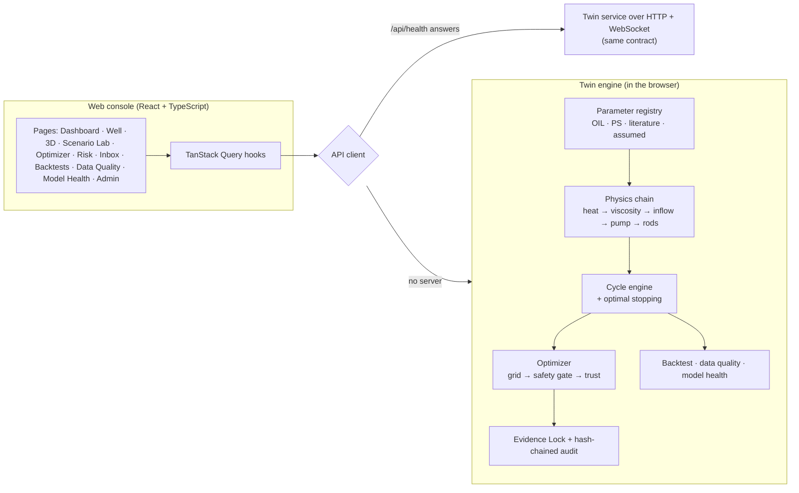

## Scope of this build

This prototype focuses on the complete engineer experience. The twin engine runs in the browser, so the demo is reliable and works offline:

| In production | In this prototype |
|---|---|
| Twin service (FastAPI + PostgreSQL/TimescaleDB) fed by OIL's SCADA, well tests and cycle records | The same twin engine in the browser (`src/mocks/`), on a simulated field of 33 wells. The API client switches to a server automatically when one answers `/api/health` |
| Models trained on OIL's history (production forecast, thermal response, pump performance, failure survival) | Physics-informed models with release gates computed on simulated history |
| NSGA-III multi-objective search | Exhaustive grid (1,485 designs × 4 objective presets), labelled as such |
| Server-enforced roles with single sign-on | Demo role switch in the UI |
| Limits from OIL's operating manual | Placeholder limits from the registry, marked as placeholders |
| Audit log in the database | Hash chain in the browser, verified on the Admin page |

Parameters OIL has not yet confirmed are labelled **ASSUMED** or **DEMO** in the registry and flagged ⚑ wherever they affect a number. **All data is simulated.** Nothing on screen is a field result.

## Tech stack

| Layer | Technology |
|---|---|
| UI | React 18, React Router 6, plain CSS design tokens, Poppins |
| 3D | Three.js (lazy-loaded, only on the 3D page) with OrbitControls and CSS2D labels |
| State & data | TanStack Query 5, Zustand |
| Charts | Hand-drawn SVG (line + band, limit bars, step plan, depth profile) |
| Tooling | Vite 5, TypeScript (strict), Vitest, headless-Chrome end-to-end smoke test |

## Project structure

```
src/
├── app/            # Router, not-found and error pages
├── api/            # Types (the API contract), client (HTTP or in-browser twin), WebSocket events, React Query hooks
├── mocks/          # The twin engine: registry, physics model, 33 wells, cycle engine, optimizer,
│                   #   evidence, state (clock, forecast ledger, audit chain), extras (3D snapshot,
│                   #   thermal, cycles, backtest, data quality, model health)
├── features/       # One folder per screen: field, well, well3d, scenario, optimize, risk, inbox,
│                   #   backtests, quality, models, admin
├── components/     # Shell, stat cards, panels, charts, metric (evidence link), drawer, icons
├── store/          # UI state (evidence popover, toasts, drafts) and demo role
├── lib/            # Formatting helpers
└── styles/         # Design tokens and layout
scripts/
├── check-no-literal-kpi.mjs   # Blocks KPI numbers typed into screens
└── e2e/                       # Chrome DevTools driver and smoke test
docs/screenshots/              # Images used in this README
```

## Available scripts

| Command | Description |
|---|---|
| `npm run dev` | Start the development server |
| `npm run build` | Typecheck and build for production into `dist/` |
| `npm run preview` | Serve the production build locally |
| `npm run check` | Typecheck + unit tests + no-typed-KPI guard |
| `npm test` | Unit tests (Vitest) |
| `npm run e2e` | End-to-end smoke test in headless Chrome against a running app (`BASE=…`) |

## License

[MIT](LICENSE)

---

Built for **Smart India Hackathon 2026** · Problem Statement **SIH26120** · Oil India Limited
